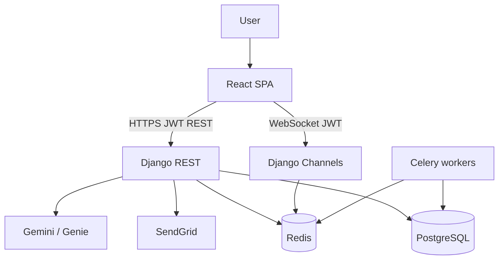

# SkyShield Edu

Interactive aviation cybersecurity training — simulations, live missions, courses, and instructor tools.

SkyShield Edu is a full-stack training platform: a React SPA in [`frontend/`](frontend/) and a Django REST + WebSocket API in [`backend/`](backend/). It helps pilots, air traffic controllers, operations teams, and training organizations practice threats such as GPS spoofing, jamming, and unauthorized ATC access.


---

## Contents

- [What it does](#what-it-does)
- [Features](#features)
- [Tech stack](#tech-stack)
- [Architecture](#architecture)
- [Repository layout](#repository-layout)
- [Quick start](#quick-start)
- [Development](#development)
- [Frontend](#frontend)
- [Backend](#backend)
- [Database](#database)
- [Authentication and authorization](#authentication-and-authorization)
- [Environment variables](#environment-variables)
- [Scripts](#scripts)
- [Testing](#testing)
- [API](#api)
- [Deployment](#deployment)
- [Status](#status)
- [Known limitations](#known-limitations)
- [Roadmap](#roadmap)
- [Contributing](#contributing)
- [Security](#security)
- [License](#license)

---

## What it does

Classroom slides do not prepare operators for GPS spoofing, radio jamming, or a compromised ATC workstation. SkyShield Edu is a training application for that gap: trainees run scenario-based simulations and live “digital twin” missions; instructors build courses and grade work; admins run the platform.

| Audience | What they do here |
| --- | --- |
| **Trainees** | Simulations, courses, exercises, certificates, live missions |
| **Instructors / supervisors** | Materials, exercises, courses, scenarios, grading, war room |
| **Admins** | Users, catalog, logs, announcements, platform analytics |

Hosts referenced in deployment configs: frontend `https://www.skyshieldedu.com`, API `https://skyshield-backend.onrender.com`.

---

## Features

### Implemented

- Public marketing pages (home, features, use cases, about, pricing, contact, help, legal).
- Email/password registration, login, logout, email verification, password reset, JWT refresh.
- Role-based portals: trainee (`/dashboard`), staff (`/tutor`), admin (`/admin`).
- Scenario catalog with bookmarks, recommendations, attempt limits, and assignments.
- Step-based simulation player (start session, submit decisions, hints, scoring, achievements).
- Immersive incident missions (phases, participants, WebSocket live state, supervisor interventions, war room).
- Structured courses (modules, enrollment, progress, certificates).
- Learning library (categories, materials, paths, bookmarks, search, glossary, FAQs, announcements).
- Tutor tools (materials, exercises, grading, students, schedule, PDF reports, course builder, scenario staff CRUD).
- Admin portal (users by role, courses, schedules, tutors, audit/error/API logs, platform analytics).
- In-app video meetings (schedule, join by code, WebRTC via `simple-peer`, STUN/TURN, chat/participants APIs).
- Trainee and platform analytics (performance, trends, skills, comparisons, certifications, retries).
- Device and session management, in-app notifications, profile and settings (including light/dark theme).
- Interactive API docs (Swagger / ReDoc via drf-spectacular).
- Database seed commands for local development.

### Partial

- **Contact forms** — UI only; they do not POST to the backend.
- **Pricing page** — static marketing copy; no payment provider is wired.
- **Social login** — Google/GitHub endpoints exist on the API; the SPA login page is email/password only (no OAuth callback route).
- **Two-factor auth** — fields exist on the user model; no TOTP enroll/verify API flow is implemented.
- **Meeting recordings** — models and a Celery task exist; the task simulates processing rather than a real recorder.
- **Genie (Gemini)** — optional AI scenario generation; disabled unless `GENIE_ENABLED` and `GENIE_API_KEY` are set.

### Not in this repository

- GitHub Actions or other CI pipelines
- A `LICENSE` file
- Frontend unit/e2e tests
- Stripe or other billing

---

## Tech stack

### Frontend

| Technology | Use |
| --- | --- |
| React 19 + TypeScript | UI |
| Vite 7 | Dev server and production build |
| React Router 7 | Client routing (lazy-loaded pages) |
| Tailwind CSS 4 + custom CSS | Styling |
| Axios | HTTP client (JWT attach + refresh) |
| TanStack React Query | Query cache (used on some portal pages) |
| React Context (`AuthProvider`) | Auth session |
| Recharts | Charts |
| simple-peer | WebRTC meetings |
| lucide-react | Icons |
| react-hot-toast | Toasts |

### Backend

| Technology | Use |
| --- | --- |
| Python 3.12, Django 4.2+ | API and Django admin |
| Django REST Framework | REST |
| djangorestframework-simplejwt | Access/refresh JWTs |
| Django Channels + Daphne | WebSockets (`/ws/meeting/…`, `/ws/mission/…`) |
| Celery + Redis | Background tasks (meeting recording cleanup/processing) |
| django-allauth + dj-rest-auth | Social login adapters (Google, GitHub) |
| drf-spectacular | OpenAPI / Swagger |
| django-anymail + SendGrid | Transactional email |
| Pillow, ReportLab | Images and tutor PDF reports |
| httpx | Gemini (Genie) HTTP calls |
| Faker | Realistic seed data |

`backend/requirements.txt` also lists packages that are **not** registered in `INSTALLED_APPS` or referenced in application code (for example `django-storages`, `boto3`, `django-axes`, `django-ratelimit`, `django-ckeditor`, `scikit-learn`). Treat those as unused unless you wire them in.

### Database and services

| Piece | Role |
| --- | --- |
| **PostgreSQL** | Primary datastore (`django.db.backends.postgresql`) |
| **Redis** | Cache, Channels (when available), Celery broker — not the primary DB |
| **Render** | Backend web service (Daphne ASGI) and optional static frontend; Postgres blueprint in `backend/render.yaml` |
| **Vercel** | Alternative SPA hosting (`frontend/vercel.json` rewrite) |
| **SendGrid** | Verification and password-reset email |
| **Google Gemini API** | Optional Genie scenario generation |
| **Google STUN + Metered OpenRelay TURN** | WebRTC ICE |

---

## Architecture

The browser talks to Django over REST (JWT) and WebSockets. Django persists to PostgreSQL, uses Redis for cache/Channels/Celery, and optionally calls SendGrid and Gemini.

```text
User
  ↓
React SPA (Vite)
  ├── REST  →  /api/*   (dev: Vite proxy to :8000; prod: VITE_API_URL)
  └── WS    →  /ws/meeting/{room}/  and  /ws/mission/{runId}/
        ↓
Django ASGI (Daphne)
  ├── REST apps: users, content, simulations, tutor, analytics, core, meetings, auth
  ├── Channels consumers
  ├── PostgreSQL
  ├── Redis (cache + channel layer + Celery broker)
  ├── SendGrid (email)
  └── Gemini (optional Genie)
```



**Request path**

1. User signs in. The SPA stores `access_token`, `refresh_token`, and `user` in `localStorage`.
2. Axios sends `Authorization: Bearer <access>`. On 401 it refreshes via `POST /api/users/token/refresh/`.
3. Role from the profile drives routing: `trainee` → `/dashboard`, `instructor`/`supervisor` → `/tutor/dashboard`, `admin` → `/admin/metrics`.
4. Simulations persist `SimulationSession` / `UserDecision`. Missions persist `IncidentRun` + events and broadcast over WebSockets.
5. Courses, materials, meetings, and analytics use the same PostgreSQL database.

**Local vs production HTTP**

- **Local:** leave `VITE_API_URL` unset. Vite proxies `/api` and `/ws` to `http://127.0.0.1:8000`.
- **Production:** build the SPA with `VITE_API_URL=https://…/api` (must be `https://`, not `http://`).

Meetings and missions require **ASGI (Daphne)**. Gunicorn/WSGI will 404 or 503 `/ws/*`.

---

## Repository layout

```text
SkyShield-edu/
├── README.md                 ← this file
├── render.yaml               ← Render blueprint (backend web service)
├── .gitignore
├── frontend/
│   ├── src/
│   │   ├── pages/            # Public, auth, dashboard, tutor, admin, meetings
│   │   ├── components/       # Layouts, mission UI, charts, marketing
│   │   ├── context/          # AuthProvider
│   │   ├── hooks/
│   │   ├── services/         # Axios domain clients
│   │   ├── lib/              # API config, routing helpers, WebSocket URLs
│   │   ├── types/
│   │   ├── assets/           # CSS + images
│   │   ├── App.tsx
│   │   ├── App.lazy.tsx
│   │   └── main.tsx
│   ├── public/
│   ├── package.json
│   ├── vite.config.ts        # Dev proxy /api and /ws → localhost:8000
│   ├── vercel.json
│   ├── render.yaml
│   └── .env.production.example
└── backend/
    ├── apps/
    │   ├── users/            # Auth, profile, devices, sessions
    │   ├── core/             # Health, uploads, logs, admin portal, seeds
    │   ├── content/          # Library, paths, FAQs, announcements
    │   ├── simulations/      # Scenarios, sessions, missions, courses, Genie
    │   ├── tutor/            # Materials, exercises, students, reports
    │   ├── analytics/        # Trainee + platform analytics
    │   └── meetings/         # Meetings, invitations, Channels consumer
    ├── config/               # Django settings, URLs, ASGI, Celery
    ├── templates/
    ├── manage.py
    ├── requirements.txt
    ├── runtime.txt           # python-3.12.2
    ├── Procfile              # daphne ASGI
    ├── start.sh
    ├── render.yaml
    └── deploy/               # Render notes, nginx WebSocket example
```

There is no root `package.json` or npm/yarn workspace. Frontend and backend are installed and run separately.

---

## Quick start

You need **Python 3.12**, **Node.js** (LTS) + npm, **PostgreSQL**, and **Redis**.

```bash
git clone <repository-url>
cd SkyShield-edu
```

**Backend**

```bash
cd backend
python -m venv .venv
# Windows: .\.venv\Scripts\Activate.ps1
# macOS/Linux: source .venv/bin/activate
pip install -r requirements.txt
```

Create `backend/.env` (names only — use your own values):

```env
SECRET_KEY=change-me-to-a-long-random-string
DEBUG=True
ALLOWED_HOSTS=localhost,127.0.0.1
DB_NAME=skyshield
DB_USER=postgres
DB_PASSWORD=
DB_HOST=127.0.0.1
DB_PORT=5432
REDIS_URL=redis://127.0.0.1:6379/0
FRONTEND_URL=http://localhost:5173
EMAIL_BACKEND=django.core.mail.backends.console.EmailBackend
```

Create the PostgreSQL database named in `DB_NAME`, then:

```bash
python manage.py migrate
python manage.py seed_realistic --yes
python manage.py runserver 8000
```

`DEBUG=True` disables HTTPS redirects so local HTTP works. `manage.py` re-executes using `backend/.venv` when that interpreter exists.

**Frontend** (new terminal; do not set `VITE_API_URL` locally)

```bash
cd frontend
npm install
npm run dev
```

Open the URL Vite prints (typically `http://localhost:5173`).

**Checks**

```bash
# API health (public)
curl http://127.0.0.1:8000/api/core/health/

cd backend && python manage.py test
cd frontend && npm run lint && npm run build
```

Seeded login accounts and extra commands are in [Development](#development). Full variable list: [Environment variables](#environment-variables).

---

## Development

Run **Redis**, **PostgreSQL**, the **API**, and the **SPA**. For meetings and missions, the API must be ASGI. With `daphne` installed, `runserver` can serve WebSockets because Daphne is prepended to `INSTALLED_APPS`.

### Prerequisites

- Python **3.12** (`backend/runtime.txt` pins `python-3.12.2`)
- Node.js (current LTS) and npm
- PostgreSQL
- Redis (local or a URL in `REDIS_URL`)

### Backend environment

```bash
cd backend
python -m venv .venv
```

Windows (PowerShell):

```powershell
.\.venv\Scripts\Activate.ps1
```

macOS / Linux:

```bash
source .venv/bin/activate
```

```bash
pip install -r requirements.txt
```

Use the `backend/.env` example from [Quick start](#quick-start). Django reads discrete `DB_*` variables — not `DATABASE_URL` (see [Known limitations](#known-limitations)).

### Database and seed data

```bash
python manage.py migrate
python manage.py seed_realistic --yes
# smaller catalog: python manage.py seed_demo
```

`seed_realistic` / `reset_and_seed` flush the database unless you pass `--seed-only`. Confirm with `--yes`. Scale: `--scale small|medium|large`. Override the seed password with `--password`.

Pinned realistic-seed accounts (default password `SkyShieldSeed2026!` — local seed only):

| Email | Role |
| --- | --- |
| `admin@skyshield.africa` | admin |
| `supervisor@skyshield.africa` | supervisor |
| `instructor@skyshield.africa` | instructor |
| `trainee@skyshield.africa` | trainee |

Demo-command accounts use the `skyshield.demo` domain (`demo.trainee@…`, `demo.supervisor@…`, `demo.admin@…`).

Optional / destructive catalog commands:

```bash
python manage.py seed_real_world          # wipes courses/scenarios/incident runs
python manage.py seed_courses
python manage.py seed_materials_schedules
python manage.py reset_and_seed --yes     # same pipeline as seed_realistic
```

Django admin on the **API host** (`/admin/`, not the React `/admin` portal):

```bash
python manage.py createsuperuser
```

### Start the API

```bash
python manage.py runserver 8000
```

Production-style local ASGI:

```bash
daphne -b 127.0.0.1 -p 8000 config.asgi:application
```

Health: `GET http://127.0.0.1:8000/api/core/health/` — `"websockets": true` when the process is Daphne or Uvicorn.

### Start the SPA

```bash
cd frontend
npm install
npm run dev
```

Vite proxies `/api` and `/ws` to `http://127.0.0.1:8000`.

### Optional: Celery

Needed only for meeting recording processing and `cleanup_old_meetings`:

```bash
cd backend
celery -A config worker -l info
```

Broker is Redis; results use `django-db`.

---

## Frontend

### Responsibilities

- Marketing and legal pages
- Auth UI and protected route guards
- Trainee learning, simulations, missions, courses, and analytics
- Staff/tutor teaching tools and supervisor war room
- Admin user/catalog/log/metrics screens
- Meeting room (camera, mic, screen share, peer connections)

### Routes

| Path | Access |
| --- | --- |
| `/`, `/features`, `/about`, `/pricing`, `/contact`, `/help`, `/privacy`, `/terms`, `/simulations`, `/usecases` | Public |
| `/careers` | Coming soon placeholder |
| `/login`, `/signup`, `/forgot-password`, `/reset-password`, `/verify-email` | Public auth |
| `/dashboard/*` | `trainee` |
| `/dashboard/mission/:runId` | `trainee` (full-screen mission player) |
| `/dashboard/war-room` | `supervisor`, `admin` |
| `/tutor/*` | `supervisor`, `admin`, `instructor` |
| `/admin/*` | `admin` |
| `/meetings/join/:code` | All authenticated roles |

Post-login homes: trainee `/dashboard`, instructor/supervisor `/tutor/dashboard`, admin `/admin/metrics`.

### State and API clients

- **Auth:** `AuthProvider` + `useAuth`; tokens in `localStorage`
- **HTTP:** `src/services/api.ts` (base URL from `resolveApiBase()`)
- **Domain clients:** `authService`, `contentService`, `simulationService`, `incidentService`, `courseService`, `tutorService`, `analyticsService`, `scenarioStaffService`, `adminPortalService`
- **Realtime:** `useMissionSocket` (`/ws/mission/{runId}/?token=…`), meeting WebSocket + WebRTC in `MeetingRoom`
- **Styling:** Tailwind plus page CSS under `src/assets/css/`. Theme key `ss-theme` in `localStorage` (`light` default)

---

## Backend

### Responsibilities

- JWT authentication and user lifecycle
- Scenario catalog, simulation sessions, incident missions, and course certificates
- Content library and announcements
- Tutor/instructor teaching APIs and PDF reports
- Admin portal listing/status APIs and audit logs
- Meeting lifecycle, ICE server lists, and WebSocket signaling
- Optional Gemini generation (`GenieViewSet`)

### Apps

| App | Prefix | Role |
| --- | --- | --- |
| `users` | `/api/users/` | Register, login, profile, devices, sessions, notifications |
| `content` | `/api/content/` | Materials, paths, glossary, FAQs, announcements |
| `simulations` | `/api/simulations/` | Scenarios, sessions, missions, courses, Genie |
| `tutor` | `/api/tutor/` | Tutor profile, materials, exercises, students, reports |
| `analytics` | `/api/analytics/` | Personal and platform analytics |
| `core` | `/api/core/` | Health, uploads, settings, admin portal, logs |
| `meetings` | `/api/meetings/` | Meetings, invitations, join |
| `dj-rest-auth` | `/api/auth/` | Library auth/registration/social URLs |

OpenAPI: `/api/schema/swagger-ui/` (backend `/` redirects here). ReDoc: `/api/schema/redoc/`.

### Authorization

- Default DRF permission: **IsAuthenticated**
- Public: register, login, token refresh, forgot/reset password, verify/resend email, health check, some content catalog reads
- Role checks in views (`IsAdminUser` app-role, `IsSupervisorOrAdmin`, `IsScenarioStaff`, `IsScenarioAuthor`, `IsPlatformAnalyticsStaff`, `IsContentStaff`, meeting host/join rules)
- Custom user model `users.User`; email is `USERNAME_FIELD`

### Business logic

- **Simulation sessions:** start → `submit_decision` / `request_hint` → complete or abandon; attempt caps and assignment cooldowns
- **Missions:** `ScenarioOrchestrator` + `SimulationEngine` + phase state machine; events are append-only; supervisors can pause / inject / force phase
- **Courses:** ordered modules (reading or simulation checkpoint); certificate when all modules pass and average meets threshold
- **Adaptive recommendations:** `AdaptiveLearningService` updates performance profiles after sessions/runs (simple scoring, not sklearn)

### Errors

- DRF serializers and HTTP status codes (`400` / `401` / `403` / `404`)
- `ErrorLog` / `APILog` / `AuditLog` models and admin log APIs
- Middleware logs client disconnects and unauthorized API hits

---

## Database

**Engine:** PostgreSQL, via `DB_NAME`, `DB_USER`, `DB_PASSWORD`, `DB_HOST`, `DB_PORT` in `backend/config/settings.py`.

`backend/render.yaml` also declares `DATABASE_URL` from a Render Postgres instance. **Settings do not parse `DATABASE_URL`.** Set the discrete `DB_*` variables (or extend settings) for the app to connect.

IDs are mostly UUIDs. Schema: `python manage.py migrate`.

| Area | Models |
| --- | --- |
| Users | `User`, `UserSession`, `UserActivity`, `UserDevice`, `UserNotification`, password/email tokens |
| Simulations | `Scenario`, `ScenarioAssignment`, `SimulationSession`, `UserDecision`, bookmarks/feedback/achievements |
| Missions | `IncidentRun`, `MissionParticipant`, `IncidentEvent`, `ThreatNode` |
| Courses | `Course`, `CourseModule`, `CourseEnrollment`, `ModuleProgress`, `CourseCertificate` |
| Content | `ContentCategory`, `LearningMaterial`, `LearningPath`, `PathEnrollment`, `FAQ`, `GlossaryTerm`, `Announcement` |
| Tutor | `TutorProfile`, `TeachingMaterial`, `TeachingSession`, `Exercise`, `ExerciseAttempt`, `StudentProgress`, `Report` |
| Meetings | `Meeting`, `MeetingParticipant`, `MeetingInvitation`, `MeetingChat`, `MeetingRecording` |
| Analytics | `UserPerformance`, `SimulationAnalytics`, `PerformanceTrend`, `SkillAssessment` |
| Core | `AuditLog`, `ErrorLog`, `APILog`, `Notification`, `FileUpload`, `SystemSetting` |

---

## Authentication and authorization

1. **Register** → verification email with `{FRONTEND_URL}/verify-email?token=…`.
2. **Login** with `identifier` (email or username) + password. Blocked if email unverified, suspended, inactive, or locked after five failed attempts (30-minute lock).
3. Response: `{ access, refresh, user }` (access 60 minutes, refresh 1 day, HS256 signed with `SECRET_KEY`).
4. SPA stores tokens; API calls use Bearer access tokens. Refresh on 401 except for login/register/refresh URLs.
5. **Roles:** `trainee`, `instructor`, `supervisor`, `admin`.
   - Meetings: create = admin/supervisor/instructor; join = host, invitee, or admin/supervisor.
   - Scenario **write** (create/update/assign): supervisor and admin. Instructors can **read** staff scenario APIs.
   - Platform analytics: supervisor, admin, instructor.
   - Admin portal (`/api/core/admin/…`): application admin role.

Google/GitHub social views exist at `/api/users/google/` and `/api/users/github/` when OAuth client IDs/secrets are set. The React app does not currently drive that flow.

---

## Environment variables

Never commit real secrets. Names and purposes only.

### Backend (`backend/.env`, loaded when not on Render)

| Variable | Used by | Purpose |
| --- | --- | --- |
| `SECRET_KEY` | Django / JWT | Signing key (Render requires length ≥ 50) |
| `DEBUG` | Django | Debug mode (`False` in production) |
| `DJANGO_SETTINGS_MODULE` | Process | `config.settings` |
| `ALLOWED_HOSTS` | Django | Comma-separated hosts |
| `DB_NAME`, `DB_USER`, `DB_PASSWORD`, `DB_HOST`, `DB_PORT` | Django | PostgreSQL connection |
| `REDIS_URL` | Cache, Channels, Celery | Redis URL (`rediss://` for TLS) |
| `CHANNEL_LAYER` | Channels | `auto` (default), `redis`, or `memory` |
| `REDIS_CONNECT_TIMEOUT`, `REDIS_SOCKET_TIMEOUT`, `REDIS_HEALTH_CHECK_INTERVAL` | Redis clients | Timeouts |
| `MISSION_WS_PING_INTERVAL_SECONDS` | Mission WS | Keepalive interval (default 25) |
| `FRONTEND_URL` | CORS, email links | SPA origin |
| `EMAIL_BACKEND` | Email | Default SendGrid Anymail backend |
| `SENDGRID_API_KEY` | Anymail | SendGrid key |
| `DEFAULT_FROM_EMAIL`, `SUPPORT_EMAIL` | Email | From/support addresses |
| `GENIE_API_KEY`, `GENIE_ENABLED` | Genie | Gemini generation (`false` unless enabled) |
| `SOCIAL_AUTH_GOOGLE_CLIENT_ID`, `SOCIAL_AUTH_GOOGLE_SECRET` | allauth | Google OAuth |
| `SOCIAL_AUTH_GITHUB_CLIENT_ID`, `SOCIAL_AUTH_GITHUB_SECRET` | allauth | GitHub OAuth |
| `DJANGO_LOG_LEVEL` | Logging | Django log level |
| `RENDER` | Settings | Set by Render; skips local `.env` |
| `PYTHON_VERSION` | Render | Documented as `3.12` |
| `PORT` | Daphne | Listen port |
| `DJANGO_SKIP_VENV_REEXEC` | `manage.py` | Skip auto-reexec into `backend/.venv` |

### Frontend (build-time Vite)

| Variable | Used by | Purpose |
| --- | --- | --- |
| `VITE_API_URL` | SPA | API base; must be `https://…/api` in production |
| `VITE_WS_URL` | SPA | Optional WebSocket origin (`wss://host`). Do not set to bare `wss://` |
| `VITE_FRONTEND_URL` | Typed in `vite-env.d.ts` | Optional frontend origin (not required for local proxy) |

Copy [`frontend/.env.production.example`](frontend/.env.production.example) for production builds.

---

## Scripts

### Frontend (`frontend/package.json`)

| Command | What it does |
| --- | --- |
| `npm run dev` | Vite dev server (proxies `/api` and `/ws`) |
| `npm run build` | `tsc -b` then Vite production build → `dist/` |
| `npm run preview` | Serve the production build locally |
| `npm run lint` | ESLint |

### Backend

| Command | What it does |
| --- | --- |
| `python manage.py migrate` | Apply migrations |
| `python manage.py runserver` | Dev server (ASGI if Daphne is installed) |
| `python manage.py collectstatic --noinput` | Collect static files (Render build) |
| `python manage.py createsuperuser` | Django admin user |
| `python manage.py test` | App `tests.py` suites |
| `python manage.py seed_realistic --yes` | Flush (unless `--seed-only`) and load realistic data; `--scale small\|medium\|large` |
| `python manage.py reset_and_seed --yes` | Same pipeline as `seed_realistic` |
| `python manage.py seed_demo` | Small demo users/courses/scenarios |
| `python manage.py seed_real_world` | Wipe catalog and load aviation scenarios (destructive to courses/scenarios/runs) |
| `python manage.py seed_courses` | Extra `[SEED]` courses |
| `python manage.py seed_materials_schedules` | Library + sample meetings/sessions |
| `daphne -b 0.0.0.0 -p $PORT config.asgi:application` | Production ASGI (`Procfile` / `start.sh`) |
| `celery -A config worker -l info` | Background workers |

---

## Testing

**Backend** — Django `TestCase` / DRF `APIClient` in each app (`apps/*/tests.py`). Needs a configured PostgreSQL database:

```bash
cd backend
python manage.py test
```

**Frontend** — no `test` script in `package.json`. Quality check:

```bash
cd frontend
npm run lint
npm run build
```

---

## API

Interactive schema (API host):

- Swagger UI: `/api/schema/swagger-ui/`
- ReDoc: `/api/schema/redoc/`
- Raw schema: `/api/schema/`

Unless noted, send `Authorization: Bearer <access>`. List endpoints are paginated (page size 20) unless a view overrides it.

### Users (`/api/users/`)

| Method | Path | Auth | Purpose |
| --- | --- | --- | --- |
| POST | `/register/` | Public | Create account; sends verification email |
| POST | `/login/` | Public | `{ identifier, password }` → JWT + user |
| POST | `/logout/` | JWT | End sessions |
| POST | `/token/refresh/` | Public | `{ refresh }` → new access |
| GET/PATCH | `/profile/` | JWT | Profile |
| POST | `/change-password/` | JWT | Change password |
| POST | `/forgot-password/` | Public | Reset email |
| POST | `/reset-password/` | Public | `{ token, new_password, … }` |
| POST | `/verify-email/` | Public | Confirm token |
| POST | `/resend-verification/` | Public | Resend |
| GET | `/activities/` | JWT | Activity log |
| * | `/devices/`, `/sessions/`, `/notifications/` | JWT | ViewSets (trust/terminate/read, etc.) |
| POST | `/google/`, `/github/` | Public | Social login (API only) |

### Content (`/api/content/`)

Categories, materials, paths, glossary, FAQs, announcements, bookmarks, search, comments. Catalog reads are often `AllowAny`; writes and enroll/bookmark actions require JWT. Staff manage announcements at `announcements/manage/`.

### Simulations (`/api/simulations/`)

| Method | Path | Purpose |
| --- | --- | --- |
| GET | `/scenarios/` | Catalog |
| POST | `/scenarios/{id}/bookmark/` | Toggle bookmark |
| GET | `/scenarios/recommended/`, `/scenarios/bookmarks/` | Personalized / saved |
| POST | `/sessions/start/` | Start `SimulationSession` |
| POST | `/sessions/submit_decision/` | Submit step choice |
| POST | `/sessions/request_hint/` | Hint |
| POST | `/sessions/{id}/abandon/` | Abandon |
| GET | `/sessions/{id}/history/` | Completed history |
| GET | `/certifications/` | Simulation badges |
| * | `/staff/scenarios/` | Staff CRUD, duplicate, assign, performance |
| GET | `/staff/scenarios/my-assignments/` | Trainee assignments |
| POST | `/scenario-assignments/{id}/revoke/` | Revoke assignment |
| POST | `/courses/{id}/enroll/` | Enroll |
| GET | `/courses/{id}/my-progress/` | Progress |
| POST | `/courses/{id}/modules/{module_id}/complete/` | Complete reading module |
| GET | `/certificates/` | Course certificates |
| POST | `/incidents/` | Start mission (`scenario_id`, optional Genie) |
| POST | `/incidents/{id}/join/` | Join run |
| POST | `/incidents/{id}/acknowledge/` | Briefing ready |
| POST | `/incidents/{id}/actions/` | Decision or `hint_request` |
| GET | `/incidents/{id}/state/` | Snapshot |
| GET | `/incidents/{id}/events/`, `/timeline/`, `/participants/`, `/score/` | Mission data |
| POST | `/incidents/{id}/abandon/` | Abandon |
| POST | `/incidents/{id}/intervention/` | Supervisor/admin only |
| POST | `/genie/generate/`, `/variation/` | AI scenario payloads |
| GET | `/genie/status/` | Genie health |

WebSocket: `ws://<host>/ws/mission/<run_id>/?token=<access>`.

### Tutor (`/api/tutor/`)

Profile, dashboard, materials, teaching sessions, attendance, exercises, attempts/grading, students (notes, track meeting), reports (`POST /reports/generate/` PDF), trainee exercise list/submit.

### Analytics (`/api/analytics/`)

JWT: `/dashboard/`, `/performance/`, `/trends/`, `/skills/`, `/learning-path/`, `/comparison/`.

Staff: `/platform/overview/`, `/platform/users/`, `/platform/performance-trends/`, `/platform/certifications/`, `/platform/retries/`.

### Core (`/api/core/`)

| Method | Path | Auth | Purpose |
| --- | --- | --- | --- |
| GET | `/health/` | Public | Liveness + WebSocket hint |
| POST | `/upload/` | JWT | File upload |
| * | `/notifications/`, `/settings/` | JWT / admin | Notifications and settings |
| GET | `/admin/stats/` | Django staff/admin | Legacy stats |
| GET | `/admin/users/`, `/supervisors/`, `/instructors/`, `/admins/`, `/tutors/`, `/courses/` | App admin | Portal lists |
| PATCH | `/admin/users/{id}/status/` | App admin | User status |
| GET | `/admin/schedule/sessions/`, `/admin/schedule/meetings/` | App admin | Schedules |
| GET | `/admin/logs/audit/`, `/errors/`, `/api/` | App admin | Logs |
| GET | `/admin/metrics/charts/` | App admin | Chart metrics |

### Meetings (`/api/meetings/`)

CRUD on `/meetings/`, plus `start`, `end`, `join` (by code; returns ICE servers), `participants`, `invite`, `chat`, `chat_history`, `recordings`. `GET /upcoming/`. Invitations ViewSet.

WebSocket: `ws://<host>/ws/meeting/<room_name>/`.

---

## Deployment

### Backend (Render)

- Runtime Python 3.12, root directory `backend`
- Build: `pip install -r requirements.txt && python manage.py collectstatic --noinput`
- Start **Daphne**, not Gunicorn WSGI:

```bash
daphne -b 0.0.0.0 -p $PORT config.asgi:application
```

(`backend/Procfile`, `backend/start.sh`, `render.yaml`). Existing Render services do not pick up `render.yaml` automatically — set the start command in the dashboard if meetings/missions return 404/503 on `/ws/`. See [`backend/deploy/RENDER.md`](backend/deploy/RENDER.md).

Set `DEBUG=False`, a long `SECRET_KEY`, `ALLOWED_HOSTS`, `FRONTEND_URL`, Redis, and **`DB_*` matching your Postgres**. After deploy, `GET /api/core/health/` should report `"websockets": true`.

### Frontend

- **Render static site:** `frontend/render.yaml` — `npm ci && npm run build`, publish `dist`, rewrite `/*` → `/index.html`. Build env: `VITE_API_URL=https://skyshield-backend.onrender.com/api` (**https**, not http).
- **Vercel:** `frontend/vercel.json` SPA rewrite to `index.html`. Set the same `VITE_API_URL` at **build** time.

Rebuild the frontend after changing Vite env vars.

Optional Nginx WebSocket example: [`backend/deploy/nginx-websocket.conf.example`](backend/deploy/nginx-websocket.conf.example).

---

## Status

| Area | Status |
| --- | --- |
| Auth (email/password, verify, reset, JWT) | Implemented |
| Role portals (trainee / tutor / admin) | Implemented |
| Simulations, missions, courses, content | Implemented |
| Meetings (WebRTC + Channels) | Implemented (ASGI required) |
| Analytics and admin metrics | Implemented |
| Seed/demo data | Implemented |
| Genie / Gemini | Implemented behind env flags |
| Contact/pricing/careers | Marketing UI (careers coming soon; contact not persisted) |
| Social OAuth UI | Backend only |
| 2FA challenge | Model fields only |
| Real meeting recording pipeline | Simulated Celery task |
| CI, license, frontend tests | Not in repo |

---

## Known limitations

- `config/settings.py` does not read `DATABASE_URL`; Render blueprints that only inject that variable still need `DB_*` (or a settings change).
- Local media/static in `DEBUG`; production file storage is local `MEDIA_ROOT` (S3 packages are unused).
- Contact and some marketing forms do not call the API.
- `@tanstack/react-query` is not used uniformly; many pages still fetch in `useEffect`.
- Staff scenario UI does not include a full visual step/hint JSON editor (API supports the fields).
- WebSockets fail if the process is Gunicorn/WSGI.
- `VITE_WS_URL=wss://` (no host) breaks meeting and mission sockets.
- Several `requirements.txt` packages are unused in code/`INSTALLED_APPS`.
- File logging under `backend/logs/` expects that directory to exist in environments that write log files.

---

## Roadmap

There is no separate product roadmap file. The items below are **gaps already visible in the codebase** and in [`frontend/FRONTEND_INTEGRATION_AUDIT.md`](frontend/FRONTEND_INTEGRATION_AUDIT.md), not a committed release plan.

**Done in-repo:** auth and role portals, simulations and missions, courses and content, meetings over Channels, analytics, seed data, optional Genie.

**Open**

- Persist contact / demo-request forms
- Social login and 2FA in the SPA
- Parse `DATABASE_URL` in Django settings for Render Postgres
- Rich scenario step editor and assignment revoke UI
- Real recording/transcode/storage instead of the mock Celery task
- Frontend tests and CI
- Broader React Query usage and route error boundaries

---

## Contributing

There is no `CONTRIBUTING.md`. Use this flow.

1. **Fork** the repository on GitHub.
2. **Clone** your fork:

   ```bash
   git clone <your-fork-url>
   cd SkyShield-edu
   ```

3. **Create a branch:**

   ```bash
   git checkout -b feature/short-description
   ```

4. **Install dependencies** as in [Development](#development) (`pip install -r requirements.txt` in `backend/`, `npm install` in `frontend/`). Configure `.env` locally; never commit it.

5. **Make changes.** If you change an API contract, update `frontend/src/services/` (or vice versa) in the same PR.

6. **Run checks:**

   ```bash
   cd backend && python manage.py test
   cd frontend && npm run lint && npm run build
   ```

   For meeting or mission work, verify WebSockets against Daphne, not WSGI.

7. **Commit** with a clear message (do not commit `.env`, secrets, `node_modules`, or venv directories).

8. **Push** your branch to your fork:

   ```bash
   git push -u origin feature/short-description
   ```

9. **Open a pull request** against the upstream default branch. Describe what changed and how you tested it.

---

## Security

Do not commit `.env` files, API keys, passwords, tokens, or private keys. `.gitignore` already ignores `.env`.

This repository does not include a `SECURITY.md` or a documented vulnerability-reporting address. Do not open a public issue with exploit details. Contact the repository maintainers through GitHub using a private channel they provide.

Production `SECRET_KEY` must be a long random string (Render enforces length ≥ 50). Seed account passwords above are for **local seed data only**.

---

## License

No `LICENSE` file is present. Rights remain with the project owners unless a license is added.

---

## Further reading

| File | Contents |
| --- | --- |
| [`backend/deploy/RENDER.md`](backend/deploy/RENDER.md) | Production WebSockets, CORS, Redis, `VITE_API_URL` |
| [`frontend/.env.production.example`](frontend/.env.production.example) | Production Vite variables |
| [`frontend/FRONTEND_INTEGRATION_AUDIT.md`](frontend/FRONTEND_INTEGRATION_AUDIT.md) | Frontend ↔ API integration notes |
| `/api/schema/swagger-ui/` | Live endpoint reference when the API is running |
